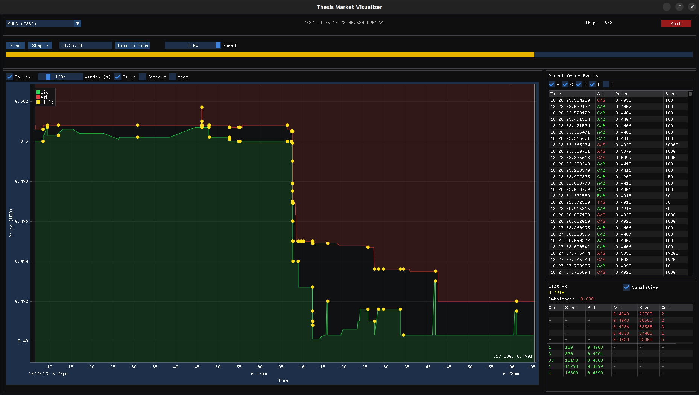

# On Detection of Spoofing in High Frequency Trading
### Unsupervised Classification of Strategic Order Placement

[](https://github.com/Alexerby/thesis-code/actions/workflows/ci.yml)
[](https://codecov.io/gh/Alexerby/thesis-code)
[](https://alexerby.github.io/thesis-code/)

*Second thesis (15 ECTS) submitted to the Department of Economics, Lund University, in candidacy for the degree of Master of Science in Economics.*

A C++ implementation of a spoofing detection framework for limit order book (LOB) markets. This project reconstructs full order lifecycles from raw L3/MBO data and extracts per-order features to separate strategic cancellations from genuine liquidity withdrawals.



[**Read the Documentation &raquo;**](https://alexerby.github.io/thesis-code/)

---

## Key Features

- **Order Life-Cycle Reconstruction**: Efficiently tracks individual orders from `Add` to `Fill` or `Cancel` using raw MBO (Market-By-Order) data.
- **Real-time Visualization**: OpenGL-based market visualizer for inspecting order book dynamics and liquidity clusters.
- **L3/MBO Support**: Native support for Databento's DBN format and XNAS.ITCH schema.
- **Performance-Oriented**: Core logic implemented in C++17.

## Requirements

| Dependency | Version |
|---|---|
| CMake | 3.24+ |
| C++ compiler | C++17+ (GCC 11+ / Clang 14+) |
| zstd | system package |
| OpenGL | system package |

```bash
sudo apt update
sudo apt install -y \
    build-essential cmake git \
    libzstd-dev libgl1-mesa-dev mesa-common-dev \
    libx11-dev libxrandr-dev libxinerama-dev \
    libxcursor-dev libxi-dev libxkbcommon-dev
```

All other dependencies (Databento SDK, ImGui, GLFW, Catch2) are fetched automatically via CMake's `FetchContent`.

## Build

```bash
chmod +x ./build.sh
./build.sh
```

To build with debug symbols:
```bash
./build.sh -DCMAKE_BUILD_TYPE=Debug
```

## Usage

```bash
./dist/thesis <command> [args] [options]
```

### Commands

| Command | Description |
|---|---|
| `desribe` | Print file metadata and instrument ID → ticker map |
| `gui` | Real-time order book visualizer (OpenGL) |
| `extract-features` | Run order tracking and write feature CSV |
| `databento-fetch` | Download historical MBO data from Databento |

### Examples

```bash
# Inspect file metadata to find instrument IDs
./dist/thesis describe data/sample.dbn.zst

# Launch the market visualizer (--symbol is required)
./dist/thesis gui data/sample.dbn.zst --symbol 38

# Extract features for instrument 38 (process entire file)
./dist/thesis extract-features data/sample.dbn.zst --symbol 38

# Extract features, cap at 5M messages, write to custom path
./dist/thesis extract-features data/sample.dbn.zst --symbol 38 --limit 5000000 --output data/features_38.csv
```

## Data

Market-By-Order (L3) data is sourced from [Databento](https://databento.com) in DBN format. The system is optimized for the `XNAS.ITCH` (NASDAQ TotalView-ITCH) schema.

### Downloading Data

1. Set your API key: `export DATABENTO_API_KEY=db-your-key-here`
2. Fetch data:

```bash
./dist/thesis databento-fetch \
    --symbols AAPL,MSFT \
    --start 2026-03-18T00:00:00Z \
    --end   2026-03-19T00:00:00Z \
    --output ./data/sample.dbn.zst
```

## Testing

The project uses [Catch2](https://github.com/catchorg/Catch2) for unit testing.

```bash
chmod +x ./run_tests.sh
./run_tests.sh
```

