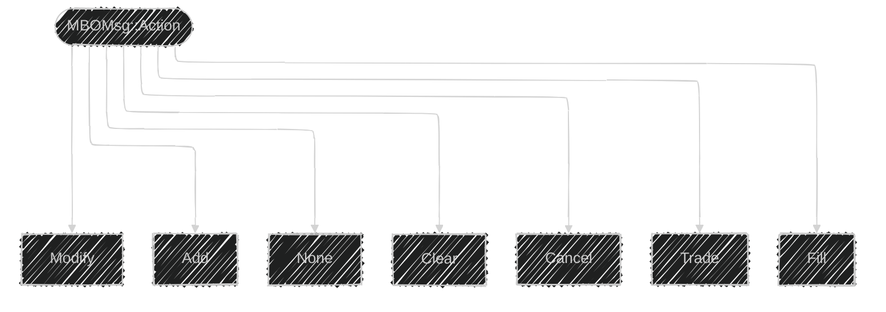
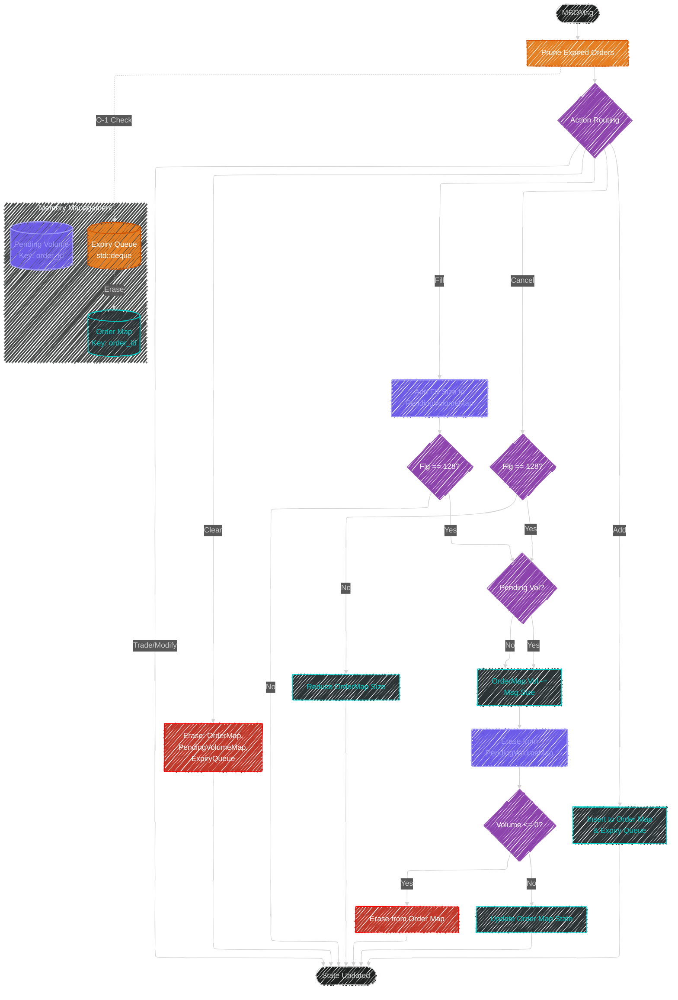

# Order (Lifetime) Tracking

This document contains guidelines and information about the algorithmic order tracking for the XNAS.ITCH market data feed.

## Routing of MBO Messages for XNAS.ITCH

The [Databento MBO Schema](https://databento.com/docs/schemas-and-data-formats/mbo#fields-mbo?historical=cpp&live=cpp&reference=python) contains multiple fields which are not utilized for the XNAS.ITCH data.
This is clearly out of necessity from Databento's side, but is not immediately clear to the end user of their historical data.

This document serves as a basis for understanding the implemented algorithm for order lifetime tracking, which should relatively easy to consume for individuals without prior experience in CPP.

### Introduction

Every MBO Message contains a field  `Action`.
The following actions are defined in the [Databento MBO Schema](https://databento.com/docs/schemas-and-data-formats/mbo#fields-mbo?historical=cpp&live=cpp&reference=python):

By inspecting the data, one will immediately arrive a couple of insights in how the messages are treated by the exchanges, and therefore Databento.

### Simplifying the MBO Schema by remapping events
* **Modifications** are not streamed as `Action::Modify`, but rather as either an `Action::Add` or an `Action::Cancel` (partial) on an existing `order_id`.
* For tracking the state of the order book ($\mathcal L_t$) `Action::Trade` is not relevant for us.
* Fill is represented by an `Action::Fill` followed by an `Action::Cancel` sharing `sequence` (and `ts_recv`).
The models in this project will use these two messages in conjunction and map this to a `Fill`.
We can therefore ignore these events when tracking the state of the order and treat an `Action::Fill` + `Action::Cancel` followed by a bitfield `F_LAST` (128) as an `Action::Fill`.

---

### Algorithm
This project implements the following algorithm for (i) routing and (ii) tracking the life duration of an order.

This algorithm requires three data structures
| Structure | Type | Key/Value | Purpose |
| :--- | :--- | :--- | :--- |
| **Order Map** | `std::unordered_map` | `order_id` $\rightarrow$ `Order` | **Persistent Store:** Quick lookup when a Cancel/Fill arrives. |
| **Staging Map** | `std::unordered_map` | `sequence_id` $\rightarrow$ `Fill` | **Staging Area:** Matches asynchronous fills to orders. |
| **Expiry Queue** | `std::deque` | `pair<order_id, ts>` | **TTL Tracker:** Keeps track of who is the "oldest" for pruning. |

