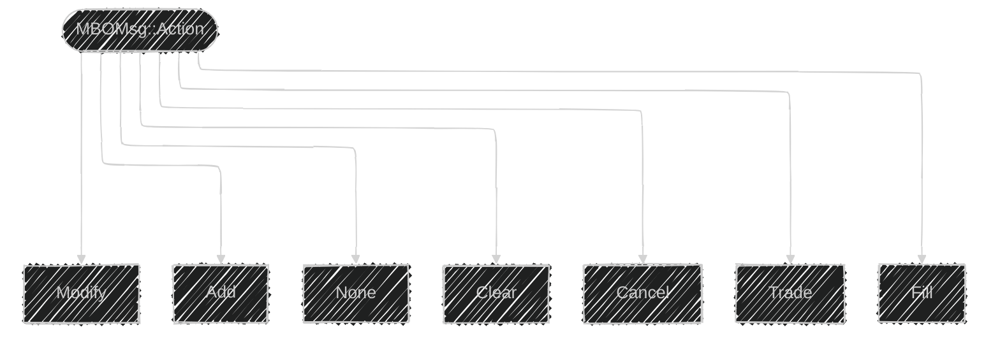

# Routing of MBO Messages for XNAS.ITCH
This document contains guidelines and information about how this project tracks orders for the XNAS.ITCH datafeed.

## Introduction

Every MBO Message contains a field  `Action`.
The following actions are defined in the [Databento MBO Schema](https://databento.com/docs/schemas-and-data-formats/mbo#fields-mbo?historical=cpp&live=cpp&reference=python):

By inspecting the data, one will immediately arrive a couple of insights in how the messages are treated by the exchanges, and therefore Databento.

## Simplifying the MBO Schema by remapping events
* **Modifications** are not streamed as `Action::Modify`, but rather as either an `Action::Add` or an `Action::Cancel` (partial) on an existing `order_id`.
* For tracking the state of the order book ($\mathcal L_t$) `Action::Trade` is not relevant for us.
* Fill is represented by an `Action::Fill` followed by an `Action::Cancel` sharing `sequence` (and `ts_recv`).
The models in this project will use these two messages in conjunction and map this to a `Fill`.
We can therefore ignore these events when tracking the state of the order and treat an `Action::Fill` + `Action::Cancel` followed by a bitfield `F_LAST` (128) as an `Action::Fill`.

---

## Algorithm
This project implements the following algorithm for (i) routing and (ii) tracking the life duration of an order.

This algorithm requires two data structures. 
* `std::unordered_map` (persistent) where the `order_id` is the key.
* `std::unordered_map` (staging area) where the `sequence_id` is the key.

```mermaid
---
config:
  layout: elk
  look: handDrawn
  theme: dark
---
flowchart TB

    %% START NODE
    A[MBOMsg] --> Action{Action Type}

    %% ADD BRANCH
    Action -->|Add| PersistentLookupAdd{Order ID in<br/>Persistent Map?}
    
    PersistentLookupAdd -->|No| NewOrder[Insert New Record<br/>into Persistent Map]
    PersistentLookupAdd -->|Yes| IncrementVol[Update Existing Record:<br/>Volume += New Volume]

    %% FILL BRANCH
    Action -->|Fill| StageFill[Store Fill Details in Staging Area<br/>Key: sequence_id]

    %% CANCEL BRANCH
    Action -->|Cancel| StagingLookup{sequence_id in<br/>Staging Area?}
    
    StagingLookup -->|Yes| ProcessFill[Reconcile Fill:<br/>Update Persistent Map Volume]
    StagingLookup -->|No| PureCancel[Reduce Order Size for Order ID from<br/>Persistent Map]

    %% EAGER CLEANUP CHECK
    ProcessFill --> VolCheck{Volume <= 0?}
    PureCancel --> VolCheck

    VolCheck -->|Yes| EraseOrder[Erase Order from<br/>Persistent Map]
    VolCheck -->|No| UpdateState[Keep Order in<br/>Persistent Map]

    %% MODIFY BRANCH
    Action -->|Modify| ModStep[Kill Program]

    %% FINAL STATES
    NewOrder --> End([Persistent State Updated])
    IncrementVol --> End
    StageFill --> End
    EraseOrder --> End
    UpdateState --> End

    %% Styling Nodes
    style Action fill:#2d3436,stroke:#00cec9
    style NewOrder fill:#1b4d3e,stroke:#2ecc71
    style IncrementVol fill:#2980b9,stroke:#3498db
    style StageFill fill:#6c5ce7,stroke:#a29bfe
    style StagingLookup fill:#6c5ce7,stroke:#a29bfe
    style PureCancel fill:#e17055,stroke:#fab1a0
    style ProcessFill fill:#e17055,stroke:#fab1a0
    style ModStep fill:#c0392b,stroke:#ff0000,color:#ffffff,stroke-width:4px
    style VolCheck fill:#8e44ad,stroke:#9b59b6
    style EraseOrder fill:#d63031,stroke:#ff7675

    %% Consistent Arrow Coloring
    %% PersistentLookupAdd paths: No (Red), Yes (Green)
    linkStyle 2 stroke:#ff4757,color:#ff4757
    linkStyle 3 stroke:#2ed573,color:#2ed573

    %% StagingLookup paths: Yes (Green), No (Red)
    linkStyle 6 stroke:#2ed573,color:#2ed573
    linkStyle 7 stroke:#ff4757,color:#ff4757

    %% Modify path: Danger (Red)
    linkStyle 8 stroke:#ff0000,stroke-width:3px,color:#ff0000

    %% VolCheck paths: Yes (Red/Destructive), No (Green/Safe)
    linkStyle 11 stroke:#ff4757,color:#ff4757
    linkStyle 12 stroke:#2ed573,color:#2ed573
```

