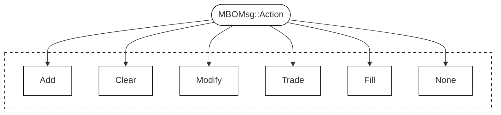
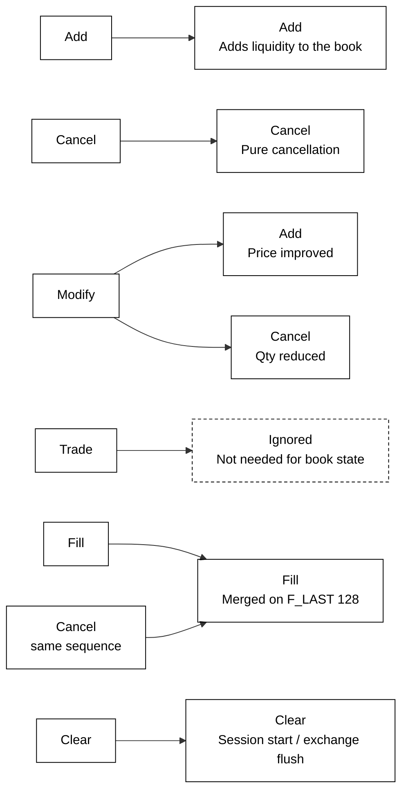

# Routing of MBO Messages
This document contains information about how the models in this project simplifies the order message routing when tracking individual orders. 

## Introduction

Every MBO Message contains a field  `Action`.
The following actions are defined in the [Databento MBO Schema](https://databento.com/docs/schemas-and-data-formats/mbo#fields-mbo?historical=cpp&live=cpp&reference=python):

By inspecting the data, one will immediately arrive a couple of insights in how the messages are treated by the exchanges, and therefore Databento.

## Simplifying the MBO Schema by remapping events
* **Modifications** are not streamed as `Action::Modify`, but rather as either an `Action::Add` or an `Action::Cancel` (partial) on an existing `order_id`.
* For tracking the state of the order book ($\mathcal L_t$) `Action::Trade` is not relevant for us.

---
## New mapping

### Add (`Action::Add`)
Nothing fancy with `Action::Add`, it is a standalone message which adds liquidity to the book.

### Cancel (`Action::Cancel`)
An `Action::Cancel` which is not followed by an `Action::Fill` (with the same `sequence` number) will be treated as a pure order cancellation.

### Trade (`Action::Trade`)
Ignored -- can reconstruct entire order book without these entries.

### Clear (`Action::Clear`)
Will be found at the start of each trading session and whenever the exchange manually flushes the books.

### Fill (`Action::Fill` && `Action::Cancel`)
Fill is represented by an `Action::Fill` followed by an `Action::Cancel` sharing `sequence` (and `ts_recv`).
The models in this project will use these two messages in conjunction and map this to a `Fill`.

We can therefore ignore these events when tracking the state of the order and treat an `Action::Fill` + `Action::Cancel` followed by a bitfield `F_LAST` (128) as an `Action::Fill`.

## The new mapping is therefore 

