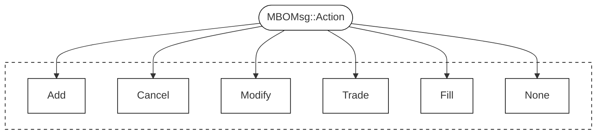

# Routing of MBO Messages

Every MBO Message comes with an `action`.
The following actions are defined in the [Databento MBO Schema](https://databento.com/docs/schemas-and-data-formats/mbo#fields-mbo?historical=cpp&live=cpp&reference=python):

By inspecting the data, one will immediately see a couple of insights.

* Modifications are not streamed as `Action::Modify`, but rather as either an `Action::Add` or an `Action::Cancel` (partial) on an existing `order_id`.

## Add
Nothing fancy with `Action::Add`, it 

